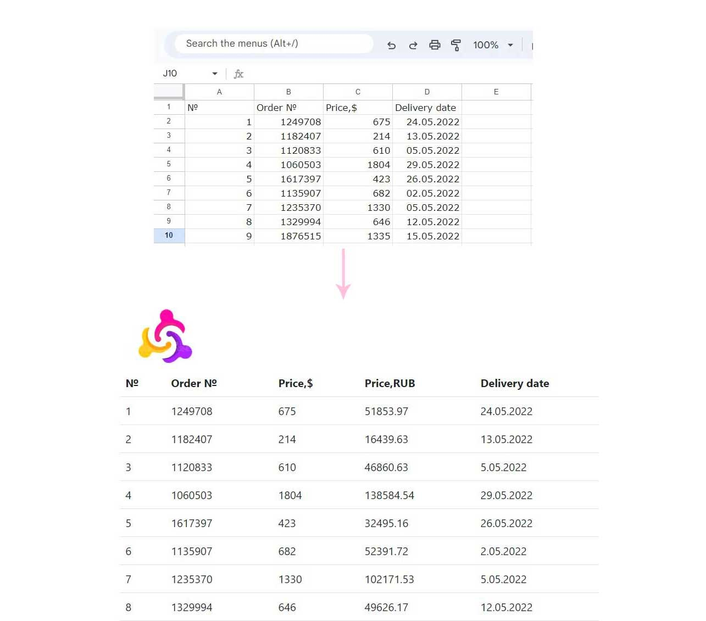

# Скрипт для получения данных с Google sheets
Тестовая таблица: https://docs.google.com/spreadsheets/d/1NFIfGUrXHXkd-e0gbtWTLO1srIz4_bsIWg52NZmcFUE/edit#gid=0

## Описание
Скрипт расположен в папке приложения sheets_app\management\commands. Его работа описана в файле google.py, запускается командой: python manage.py google.
Разработано одностраничное веб-приложение на осноове Django Templates, которое отдает таблицу с данными.
Запуск в 3 контейнерах через docker-compose (приложение, база данных, nginx)


## Запуск приложения (для Windows)
### Для запуска проекта выполните следующее:

Скопируйте на локальный компьютер проект (по SSH) затем перейдите в папку с ним:

```bash
git clone git@github.com:t0pdog/google-sheets-script.git
```
### Нужно зарегистрировать в console.cloud.google.com проект, создать сервисный аккаунт, и получить файл с ключом Service account key, переименовать его в service_account.json и положить по следующему адресу: \google_sheets_script\sheets_app\management\commands\gspread\service_account.json.
Затем создать Гугл таблицу и выдать в ней доступ редактора для сервисного аккаунта.

Файл .env уже присутствует, его создавать не нужно.

Разверните и активируйте виртуальное окружение.
```
python -m venv venv
. venv/Scripts/activate
```
Установите Docker на компьютер.

Перейдите в папку с docker-compose.yaml и запустите docker-compose командой
```
docker-compose up
```

Выполните поочередно команды.
```
docker-compose exec web python manage.py migrate
docker-compose exec web python manage.py createsuperuser
docker-compose exec web python manage.py collectstatic --no-input 
docker-compose exec web python manage.py google
```
### Проект и админка доступны по адресам:
http://localhost/
http://localhost/admin/
